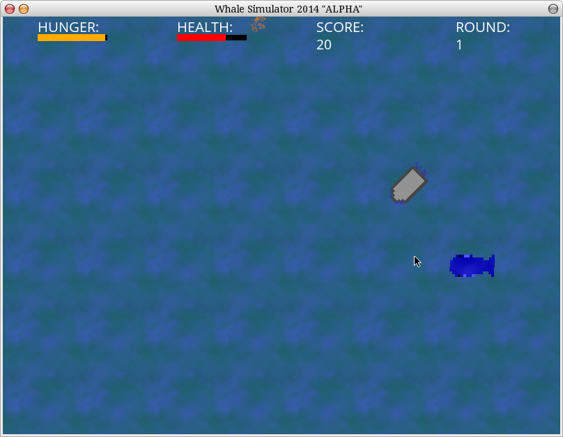

<b>Whale Simulator</b>
====================

The world's premiere whale simulator. 

How to install from github .zip file: 

1. Download and install/compile <a href="https://love2d.org/" title="LOVE download">LÖVE2D</a>.
2. Download Whale Simulator
3. Extract .zip
4. Go into the new folder that was created
5. If you are on *nix or a linux machine you just <b>should</b> click on the <b>generateGame.sh</b> and go to step 7, if you aren't on one of these machines you have to zip all the src files with the libs and assets folder.
6. Change .zip to .love on windows and play the game
7. Got to the out/ folder and excute the game :)

And one <b>note</b>: The game should work with LÖVE2D 0.9 and 0.8.

<b>Contributors</b>
==
* <a href="https://github.com/DaemonLee">Daemon L. Schmidt</a>
* Rafael C. Nunes(Me)
* Timmy Jacobs (MrWhales)
